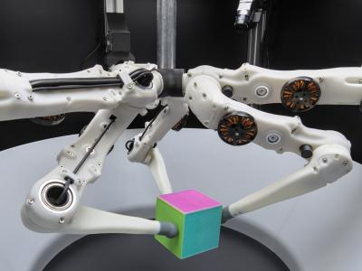

robot_fingers: (Tri-)Finger Robot Driver and Tools
--------------------------------------------------

Drivers, examples and basic scripts for the (Tri)Finger robots.

The source code is hosted on GitHub_.  Please also use the `Bug Tracker`_ there
if you have a question or want to report a bug.

For more information, on the TriFinger robot and the general architecture of the
software, see also our paper_ on the open-source version of the TriFinger robot.

This package implements a ``RobotDriver`` for the (Tri-)Finger robots based on
our robot_interfaces_ package.

Links
-----

- Documentation_
- `Source Code`_
- `Bug Tracker`_

License
-------

This package is published under the `BSD 3-Clause License <LICENSE>`_.

Copyright (c) 2020 Max Planck Gesellschaft

.. _GitHub: https://github.com/open-dynamic-robot-initiative/robot_fingers
.. _Source Code: https://github.com/open-dynamic-robot-initiative/robot_fingers
.. _Bug Tracker: https://github.com/open-dynamic-robot-initiative/robot_fingers/issues
.. _paper: https://arxiv.org/abs/2008.03596
.. _Documentation: http://people.tuebingen.mpg.de/mpi-is-software/robotfingers/docs/robot_fingers
.. _robot_interfaces: http://people.tuebingen.mpg.de/mpi-is-software/robotfingers/docs/robot_interfaces
