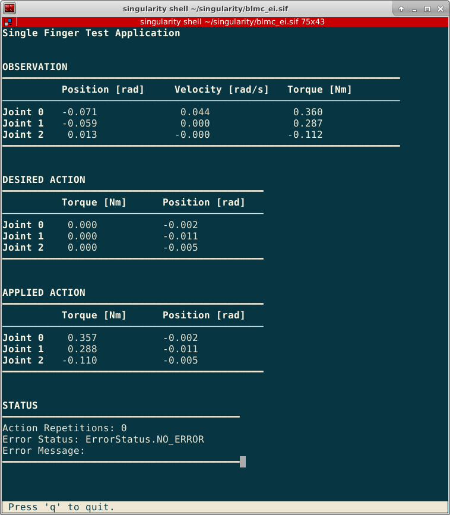

Tools for Hardware Testing
==========================

Single Finger Test
------------------

The **robot_fingers** package provides a script ``single_finger_test.py`` for
testing basic functionality of a single Finger. After initialization, it holds
all joints at their current position using position control. All available data
is shown and constantly updated on the terminal:

Running
~~~~~~~

Start the application with the following command::

    ros2 run robot_fingers single_finger_test

For this application, homing is done without end stops, that is the
joints will simply home on the nearest encoder index without offset.

To quit simply press "q".

Configuration
~~~~~~~~~~~~~

The robot configuration used in application is found in
``robot_fingers/config/single_finger_test.yml``. Typically the configuration
should work well, however, you may need to adjust the CAN ports to match the
ports on which the finger is connected.
