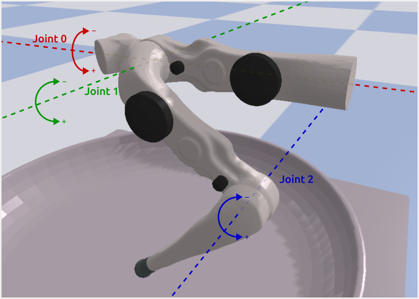
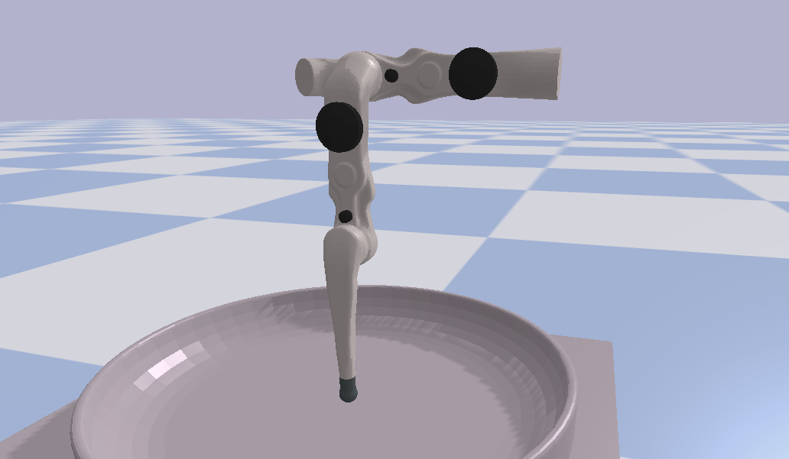

*************************
Joint Order and Direction
*************************

The :doc:`action and observation structs <actions_and_observations>` contain arrays for
joint positions, torques, etc.  Each entry in these arrays corresponds to one joint of
the robot.

Joint Order
===========

On the finger robots, joints for each finger are ordered from the base towards the tip:

For TriFinger robots, the joints of the three fingers ("finger0", "finger120" and
"finger240") are each ordered as shown above and then concatenated.  That is, the joint
array is ordered like this:

::

    finger0_joint0, finger0_joint1, finger0_joint2, finger120_joint0, ..., finger240_joint2

See :ref:`trifinger_docs:finger_and_camera_names` on how the three fingers are mounted
for TriFingerPro.

Joint Directions
================

For "FingerPro" and "FingerEdu" fingers, directions of rotation (i.e. which direction is
positive and which is negative) is as depicted in the image above.
For "FingerOne", joint 1 is inverted, the others are the same.

Zero Position
=============

All joints are in zero-position when the finger is pointing straight down:

